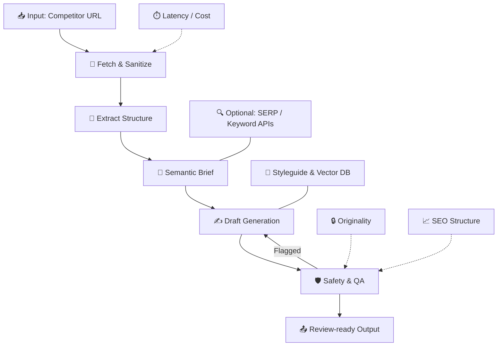

# 💭 AI-Assisted Blog Draft Pipeline

 - **🎯 Goal:** Convert a competitor blog URL → a **safe**, **original**, **SEO-aware**, **review-ready** Sendmarc article.  
- **Principles:** 🧠 Pragmatic · 🔒 Safe · ⚙️ Deterministic · 🧭 Thoughtful LLM usage

---

# 🗺️ 1. System Overview

A modular pipeline that extracts conceptual structure from a competitor article (not the phrasing), builds a semantic brief, generates an original draft aligned with Sendmarc’s voice, and validates it through SEO, readability, and safety scoring.

---

# 🔄 2. End-to-End Flow

## 🧹  Fetch & Sanitize
- ⚡ **Fast path:** HTTP fetch + Cheerio  
- 🖥️ **Fallback:** Playwright for JS-heavy sites  
- 🧼 **Sanitize:** Remove navigation, ads, scripts

**Why:**  
Keeps extraction **fast**, removes competitor **phrasing**, and avoids LLM contamination.

---

## 🧩 Extract Structure
We capture the **shape**, not the **words**:
- H1–H3  
- Paragraph blocks  
- Entities  
- Meta description  
- Clean text for embeddings  

**Why:**  
This provides a content **blueprint** without violating IP boundaries.

---

## 🧠  Semantic Brief
A deterministic mini-spec:
- Outline  
- Tone/style from RAG  
- Content gaps  
- Simple keyword suggestions  

**Why:**  
Reduces hallucination and enforces **brand voice** consistently.

---

## ✍️  Draft Generation
- Section-by-section prompting  
- RAG-conditioned tone  
- HTML output with headings, alt text, metadata  

**Why:**  
Controlled generation → higher quality, lower drift, more SEO-structured output.

---

## 🛡️  Safety & QA
Includes:
- 🔒 Paragraph-level similarity checks  
- 📈 SEO rule validation  
- 📚 Readability scoring  
- 📝 Optional plagiarism API  

**Why:**  
Ensures **originality**, **quality**, and **structural SEO readiness**.

---

## 📤  Review-Ready Output
The system produces:
- Full HTML draft  
- Title + slug  
- Meta description  
- JSON-LD Article schema  
- Internal linking suggestions  
- Alt-text for all images  

**Why:**  
Meets the brief: a **review-ready** blog entry suitable for editorial approval.

---

# 🧱 3. Architecture & Tooling

## 🧹 Fetching
- **Cheerio:** ⚡ fast, deterministic  
- **Playwright:** 🖥️ guaranteed completeness when needed  
**Tradeoff:** Optimizes cost → robustness only when required.

## 🧩 Parsing
- Cheerio for structural extraction  
**Tradeoff:** Zero hallucinations.

## 🎨 Tone & RAG
- Embeddings of styleguide & past posts  
**Tradeoff:** Strong tone enforcement without inflating prompts.

## ✍️ LLM Strategy
- Small model → outline  
- Large model → main draft  
**Tradeoff:** Best quality per cost.

## 🛡️ Safety Layer
- Embedding similarity checks  
**Tradeoff:** Modern, semantic-level originality scoring.

## ⚙️ Orchestration
- Serverless / Supabase Functions  
**Tradeoff:** Stateless, scalable, simple.

## 🔧 CI
- GitHub Actions heuristic tests  
**Tradeoff:** Early detection of extraction drift.

---

# 📊 4. Evaluation & Metrics

Success = **original**, **SEO-structured**, **tone-aligned**, **predictable performance**.

---

## 🔒  Originality (Safety)
- **Metric:** `originality_max`  
- **Threshold:** `< 0.85`  
- **Method:** cosine similarity on embeddings  
**Ensures:** Semantic originality & IP safety.

---

## 📈  SEO Structure Score
Weighted checklist (0–100):
- One H1  
- Clean hierarchy  
- Meta description  
- Alt text  
- Internal links  

**Method:** Deterministic rule engine  
**Ensures:** Search-ready structure.

---

## 📚  Readability & Tone
- `readability_flesch` (50–70 target)  
- `avg_sentence_length`  

**Ensures:** Clear, confident Sendmarc tone.

---

## ⏱️  System Performance
- Fast path <5s  
- Fallback <20s  
- Cost < $1 per draft  
- Fallback rate tracked  

**Ensures:** Predictable runtime & cost.

---

## 📝  Human Rewrite Rate
- % requiring significant edits  
- Simple "needs rewrite?" toggle  
**Ensures:** Practical quality measurement.

---

# 📡 Monitoring (Notional)

The system can track:
- 📈 Average SEO score  
- 🔒 Originality score distribution  
- ⏱️ Latency trends  
- 🛑 Frequency of flagged drafts  
- 🧑‍💻 Weekly rewrite rates  

Lightweight and effective — no heavy SEO tooling needed.

---

# 🚀 5. Next Steps (Future Work)
- TF-IDF / n-gram keyword extraction  
- SERP difficulty scoring  
- Internal link graph  
- Topic clustering  
- Automated fact checking  

**Why:** These add value but exceed assignment scope.
### 🕷️ Maybe also: add a competitor crawler 
A crawler could periodically discover and ingest competitor posts automatically instead of relying on manually supplied URLs.

**Benefits:**
- Builds a continuously updated competitor content library  
- Enables topic clustering and long-term trend analysis  
- Supports automated gap detection across multiple domains  
- Powers bulk testing of extraction and generation logic  

**Tradeoffs & Risks:**
- Must respect robots.txt and legal boundaries  
- Requires scheduling, caching, and storage infrastructure  
- Increased operational cost and complexity  
- Extraction drift must be monitored across many templates  

**Why not included now:**  
A crawler is valuable but extends beyond the assignment’s scope.  
The system remains URL-driven, simple, and deterministic, while a crawler can be layered on later as a separate subsystem.

---

# 🧪 6. Let's Code
Includes:
- Fast + fallback fetch  
- Sanitization  
- Structure extraction  
- Semantic brief  
- Draft generation  
- Similarity checks  
- GitHub Action heuristic test  
- Styleguide RAG corpus  

### 🏃‍♂️‍➡️  Run me on your local

1. Clone the repo:

       git clone https://github.com/d1ln/sendseo.git

2. Install dependencies:

       npm install

### 🧙‍♂️ Mock Mode (no api keys required)
Runs instantly, no API keys, fully deterministic.

1. Run the full demo (server + static UI) with one command:

       npm run demo:local

2. Open the UI:

       http://localhost:8000/index.html

3. Paste any competitor blog URL → click **Generate** → mock draft + metrics appear.

Notes:
- No API keys required.
- No network calls.
- Playwright is disabled automatically.
- Perfect for interviews and offline demos.

### 🤖 Real LLM Mode (yolo)
Uses real OpenAI generation for outline + draft.

1. Set environment variables:

   macOS/Linux:
   
       export OPENAI_API_KEY="sk-..."
       export PLAYWRIGHT_ENABLED=false

   Windows PowerShell:

       $env:OPENAI_API_KEY="sk-..."
       $env:PLAYWRIGHT_ENABLED="false"

2. Start the server:
   
       npm run demo:local

3. Open:

       http://localhost:8000/index.html

4. Paste any competitor URL → click **Generate** → LLM-produced draft appears.

Notes:
- Real LLM mode costs tokens.
- PLAYWRIGHT_ENABLED=false ensures a stable demo.
- If you remove the flag, browser fallback may require system dependencies.

### 🩻 Health Check (Optional)

Verify the server is running:

       curl http://localhost:3000/health
