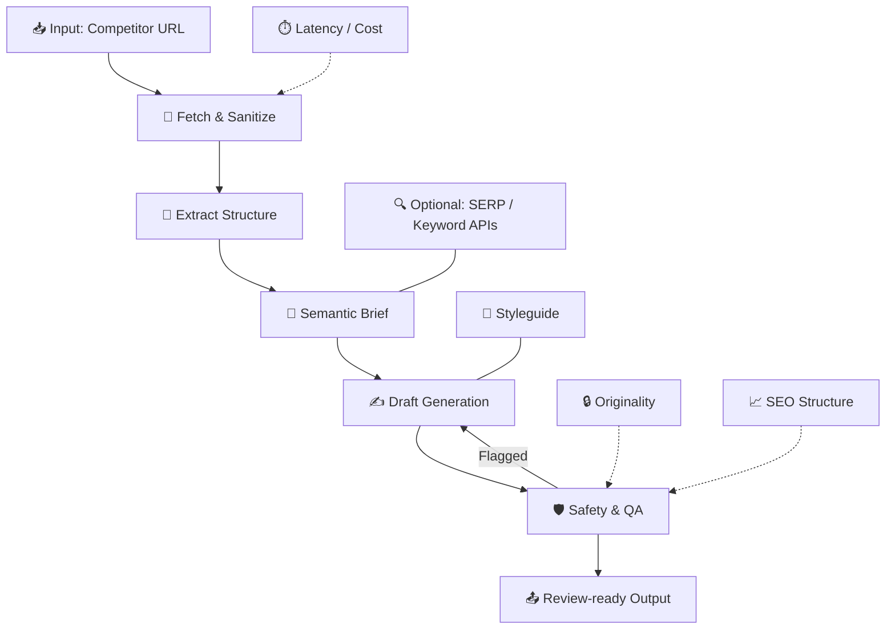

# 💭 AI-Assisted Blog Draft Pipeline

- **🎯 Goal:** Convert a competitor blog URL → a **safe**, **original**, **SEO-aware**, **review-ready** Sendmarc article.
- **Principles:** 🧠 Pragmatic · 🔒 Safe · ⚙️ Deterministic · 🧭 Thoughtful LLM usage

---

# 🗺️ 1. System Overview

A modular pipeline that extracts conceptual structure from a competitor article (not the phrasing), builds a semantic brief, generates an original draft aligned with Sendmarc’s voice, and validates it through SEO, readability, and safety scoring.

---

# 🔄 2. End-to-End Flow

## 🧹 Fetch & Sanitize

- ⚡ **Fast path:** HTTP fetch + Cheerio
- 🖥️ **Fallback:** Playwright for JS-heavy sites
- 🧼 **Sanitize:** Remove navigation, ads, scripts

**Why:**  
Keeps extraction **fast**, removes competitor **phrasing**, and avoids LLM contamination.

---

## 🧩 Extract Structure

We capture the **shape**, not the **words**:

- H1–H3
- Paragraph blocks
- Entities
- Meta description
- Clean text for similarity check

**Why:**  
This provides a content **blueprint** without violating IP boundaries.

---

## 🧠 Semantic Brief

A deterministic mini-spec:

- Outline
- Tone/style from styleguide
- Content gaps
- Simple keyword suggestions

**Why:**  
Reduces hallucination and enforces **brand voice** consistently.

---

## ✍️ Draft Generation

- Section-by-section prompting
- Styleguide-conditioned tone
- HTML output with headings, alt text, metadata

**Why:**  
Controlled generation → higher quality, lower drift, more SEO-structured output.

---

## 🛡️ Safety & QA

Includes:

- 🔒 Paragraph-level similarity checks
- 📈 SEO rule validation
- 📚 Readability scoring
- 📝 Optional plagiarism API

**Why:**  
Ensures **originality**, **quality**, and **structural SEO readiness**.

---

## 📤 What the Pipeline Outputs Today

The pipeline currently returns:

- **Title**
- **Structured article body (HTML)** with H2-level sections
- **Basic metrics**
  - Originality score
  - Word count

**Why:**
This keeps the system fast, deterministic, and aligned with the required assignment scope.

---

## 🧱 Optional Future Enhancements (Architecturally Supported)

The design deliberately anticipates additional SEO and editorial modules.  
These are **not implemented today**, but the architecture supports plugging them in with minimal changes:

- **Meta description generation**
- **Slug creation**
- **JSON-LD Article schema**
- **Internal linking suggestions**
- **SEO keyword reinforcement**
- **Automatic alt-text generation**

These would expand the pipeline into a _fully publish-ready_ system, while preserving safety, originality, and tone control.

---

# 🧱 3. Architecture & Tooling

## 🧹 Fetching

- **Cheerio:** ⚡ fast, deterministic
- **Playwright:** 🖥️ guaranteed completeness when needed  
  **Reasoning:** Optimizes cost → robustness only when required.

## 🧩 Parsing

- Cheerio for structural extraction  
  **Reasoning:** Fast and deterministic, but limited to static HTML. JS-rendered or interactive pages require a fallback (Playwright).

## 🎨 Tone & Styleguide Conditioning

- The pipeline uses a **deterministic, text-based styleguide block** injected directly into prompts.
- This ensures Sendmarc’s voice, tone, do/don’ts, formatting, and SEO preferences are always applied the same way.

**Reasoning:**  
Styleguide injection is chosen instead of RAG because:

- ⚡ Faster (no embeddings lookup or vector search)
- 💰 Cheaper (no vector DB required)
- 🔒 Fully deterministic (matches assignment requirement)
- 🧱 Perfect for fixed rules like tone, formatting, disclaimers, voice, etc.
- 🎯 Reduces prompt size and avoids semantic drift

## ✍️ LLM Strategy

- Small model → outline
- Large model → main draft  
  **Reasoning:** Cost effective.

## 🛡️ Safety Layer

- Embedding similarity checks  
  **Reasoning:** Modern, semantic-level originality scoring.

### ⚙️ Orchestration

**Serverless-first design** (e.g., Supabase Functions, Vercel, Cloudflare Workers).

**Reasoning:**

- 🧱 **Stateless** — each request is independent
- 🔁 **Easily automatable** — perfect for scheduled scans or bulk generation
- 🧩 **Simple to deploy** — small, single-purpose functions
- 💸 **Cost-efficient** — pay only for usage
- 🌍 **Scalable** — handles spikes in load with zero config

The current implementation runs locally for simplicity,  
but the architecture is intentionally built to drop into a serverless environment with minimal changes.

### 🔧 CI

**GitHub Actions heuristic tests**

**Reasoning:**

- 🛰️ **Early detection of extraction drift** — catches changes in competitor site templates
- 🧪 **Automated regression checks** — ensures fetch/extract logic remains stable
- ⚠️ **Flags brittle selectors** before they affect production
- 📊 **Lightweight monitoring** without needing full observability tools

A small set of deterministic tests helps guarantee that the pipeline remains reliable as websites evolve.

---

# 📊 4. Evaluation & Metrics

Success = **original**, **SEO-structured**, **tone-aligned**, **predictable performance**.

---

## 🔒 Originality (Safety)

- **Metric:** `originality_max`
- **Threshold:** `< 0.85`
- **Method:** cosine similarity on embeddings  
  **Ensures:** Semantic originality & IP safety.

---

## 📈 SEO Structure Score

Weighted checklist (0–100):

- One H1
- Clean hierarchy
- Meta description
- Alt text
- Internal links

**Method:** Deterministic rule engine  
**Ensures:** Search-ready structure.

---

## 📚 Readability & Tone

- **readability_flesch** (target: 50–70)
- **avg_sentence_length** (target: 12–18 words)

**Why this matters:**

- 🗣️ Ensures the article sounds **clear, confident, and professional**
- ✂️ Detects overly long or complex sentences that slow readers down
- 🎯 Keeps the draft aligned with **Sendmarc’s friendly-professional tone**
- 🔍 Helps maintain consistency across all auto-generated articles

These lightweight metrics act as guardrails, not constraints — they help the system flag sections that feel off-brand or hard to read, without interfering with the LLM’s creativity.

---

## ⏱️ System Performance

- Fast path <5s
- Fallback <20s
- Cost per draft should be kept low
- Fallback rate tracked

**Ensures:** Predictable runtime & cost.

---

## 📝 Human Rewrite Rate

- **Percentage of drafts requiring significant manual edits**
- **Human feedback after each article** (informal or structured)

**Why this matters:**  
Tracks whether the system is producing review-ready content consistently, and highlights where prompts or extraction may need refinement.

---

## 📡 Monitoring (Notional)

The system can track:

- 📈 Average SEO score
- 🔒 Originality score distribution
- ⏱️ Latency trends
- 🛑 Frequency of flagged drafts
- 🧑‍💻 Weekly rewrite rates

Lightweight and effective — no heavy SEO tooling needed.

---

# 🚀 5. Next Steps (Future Work)

- TF-IDF / n-gram keyword extraction
- SERP difficulty scoring
- Internal link graph
- Topic clustering
- Automated fact checking

**Why:** These add value but exceed assignment scope.

### ⚡ Potential Performance Enhancements

The architecture supports adding speed-oriented features such as:

- Parallel section generation
- Outline + draft combined into a single LLM call
- Adaptive model selection based on content complexity
- Lightweight “speed mode” skipping Playwright and long-context prompts
- Persistent caching of extraction results

These are not implemented today, but the system is structured so they can be added with minimal refactoring.

### 🕷️ Maybe also: add a competitor crawler

A crawler could periodically discover and ingest competitor posts automatically instead of relying on manually supplied URLs.

**Benefits:**

- Builds a continuously updated competitor content library
- Enables topic clustering and long-term trend analysis
- Supports automated gap detection across multiple domains
- Powers bulk testing of extraction and generation logic

**Reasonings & Risks:**

- Must respect robots.txt and legal boundaries
- Requires scheduling, caching, and storage infrastructure
- Increased operational cost and complexity
- Extraction drift must be monitored across many templates

**Why not included now:**  
A crawler is valuable but extends beyond the assignment’s scope.  
The system remains URL-driven, simple, and deterministic, while a crawler can be layered on later as a separate subsystem.

---

# 🧪 6. Let's Code

Includes:

- Fast + fallback fetch
- Sanitization
- Structure extraction
- Semantic brief
- Draft generation
- Similarity checks
- GitHub Action heuristic test
- Integrated styleguide prompt block for tone enforcement

### 🏃‍♂️‍➡️ Run me on your local

1. Clone the repo:

   git clone https://github.com/d1ln/sendseo.git

2. Install dependencies:

   npm install

### 🧙‍♂️ Mock Mode (no api keys required)

Runs instantly, no API keys, fully deterministic.

1. Run the full demo (server + static UI) with one command:

   `npm run demo:mock`

2. Open the UI:

   http://localhost:8000/index.html

3. Paste any competitor blog URL → click **Generate** → mock draft + metrics appear.

Notes:

- No API keys required.
- No network calls.
- Playwright is disabled automatically.

### 🤖 Real LLM Mode (only tested with OpenAI)

Uses real OpenAI generation for outline + draft.

1. Set environment variables:

   Copy the example env file:

   `cp .env.example .env`

   Open `.env` and add your keys:

   `OPENAI_API_KEY=your_openai_api_key`
   `CLAUDE_API_KEY=your_claude_api_key`

2. Start the pipeline:

   `npm run demo:auto`

3. Go to:

   http://localhost:8000/index.html

4. Paste any competitor URL → click **Generate** → LLM-produced draft appears.

Notes:

- Real LLM mode costs tokens.

### 🩻 Health Check

Verify the server is running:

       curl http://localhost:3000/health
